# 实验五  基于 Scapy 编写端口扫描器


## 实验目的

- 掌握网络扫描之端口状态探测的基本原理


## 实验环境

- python + scapy


## 实验要求

- 禁止探测互联网上的 IP ，严格遵守网络安全相关法律法规
- 完成以下扫描技术的编程实现
    - TCP connect scan / TCP stealth scan
    - TCP Xmas scan / TCP fin scan / TCP null scan
    - UDP scan
- 上述每种扫描技术的实现测试均需要测试端口状态为：`开放`、`关闭` 和 `过滤` 状态时的程序执行结果
- 提供每一次扫描测试的抓包结果并分析与课本中的扫描方法原理是否相符？如果不同，试分析原因；
- 在实验报告中详细说明实验网络环境拓扑、被测试 IP 的端口状态是如何模拟的

## 网络拓扑

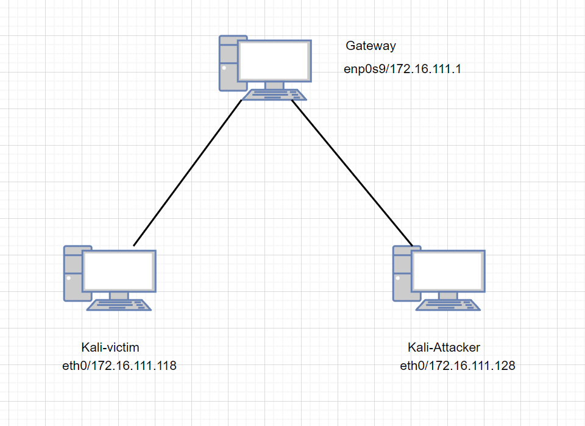


## 实验过程

### 端口状态模拟

- 关闭状态：端口监听关闭；防火墙关闭。

  ```
  ufw disable
  ```

- 开启状态：端口开启监听; 防火墙关闭。

  ```
  systemctl start apache2 # apache2基于TCP, 在80端口提供服务；
  systemctl start dnsmasq # DNS服务基于UDP,在53端口提供服务；
  ```

- 过滤状态：端口开启监听；防火墙开启。

  ```
  ufw enable && ufw deny 80/tcp
  ufw enable && ufw deny 53/udp
  ```

- 靶机抓包操作

  ```
  sudo tcpdump -i eth0 -enp -w catch_from_eth0.pcap
  ```

- nmap

  ```
  nmap -sT -p 80 172.16.111.118
  nmap -sU -p 53 172.16.111.118
  ```

### 初始状态

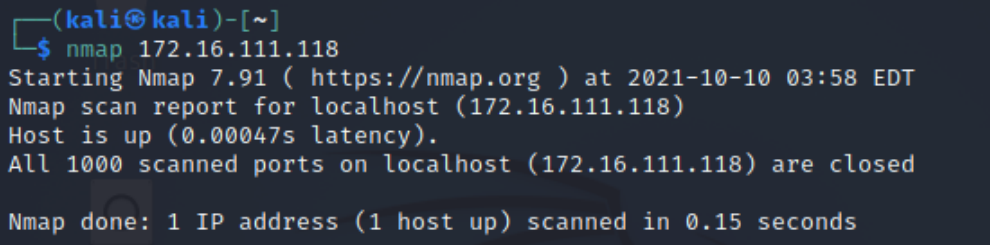

### 1. TCP connect scan 

- code

  ```
  from scapy.all import *
  
  
  def tcpconnect(dst_ip, dst_port, timeout=10):
      pkts = sr1(IP(dst=dst_ip)/TCP(dport=dst_port,flags="S"),timeout=timeout)
      if pkts is None:
          print("Filtered")
      elif(pkts.haslayer(TCP)):
          if(pkts.getlayer(TCP).flags == 0x12):  #Flags: 0x012 (SYN, ACK)
              send_rst = sr(IP(dst=dst_ip)/TCP(dport=dst_port,flags="AR"),timeout=timeout)
              print("Open")
          elif (pkts.getlayer(TCP).flags == 0x14):   #Flags: 0x014 (RST, ACK)
              print("Closed")
  
  tcpconnect('172.16.111.118', 80)
  ```

- 关闭状态

  - 攻击者主机运行代码

    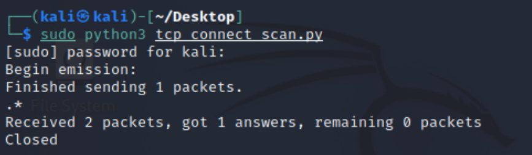

  - 靶机抓包结果

    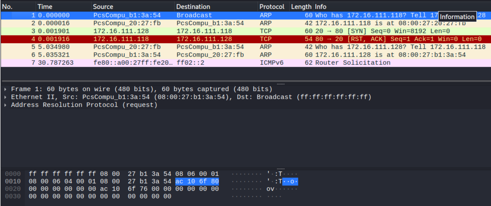

  - nmap复刻

    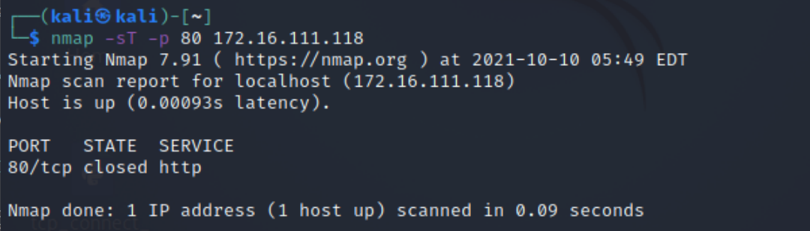

- 开启状态

  - 攻击者主机运行代码

    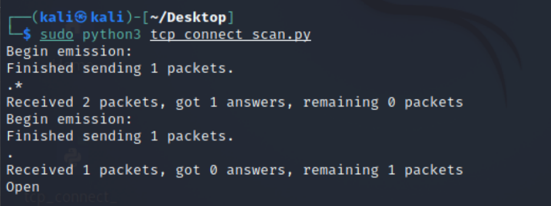

  - 靶机抓包结果

    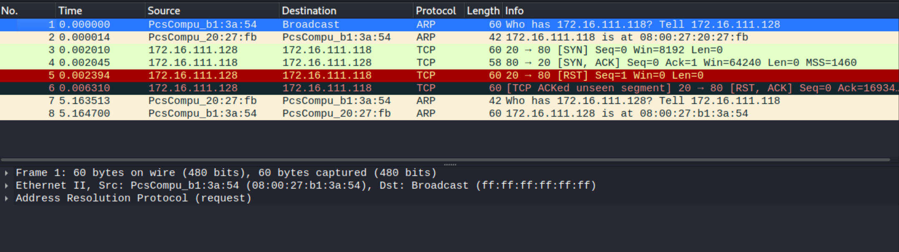

  - nmap复刻

    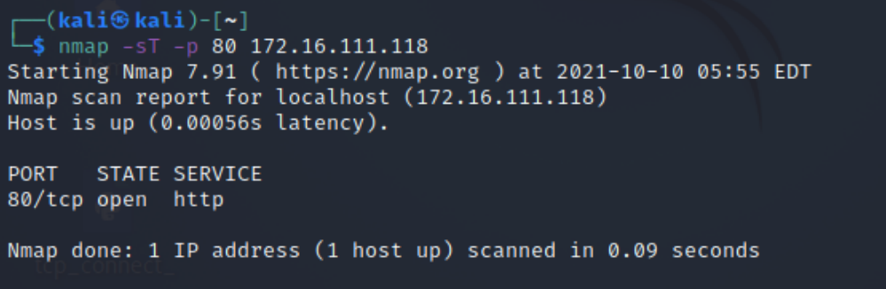

- 过滤状态

  - 攻击者主机运行代码

    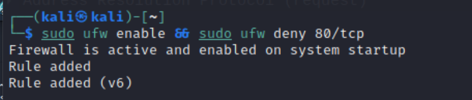

  - 靶机抓包结果

    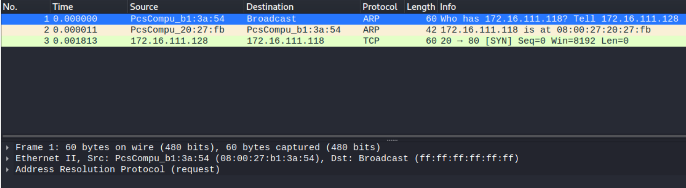

  - nmap复刻

    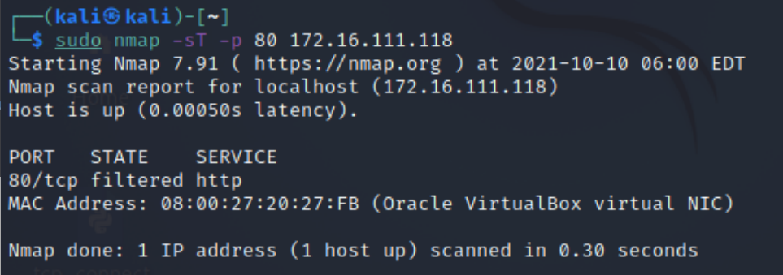

### 2. TCP stealth scan

```
from scapy.all import *


def tcpstealthscan(dst_ip, dst_port, timeout=10):
    pkts = sr1(IP(dst=dst_ip)/TCP(dport=dst_port, flags="S"), timeout=10)
    if (pkts is None):
        print("Filtered")
    elif(pkts.haslayer(TCP)):
        if(pkts.getlayer(TCP).flags == 0x12):
            send_rst = sr(IP(dst=dst_ip) /
                          TCP(dport=dst_port, flags="R"), timeout=10)
            print("Open")
        elif (pkts.getlayer(TCP).flags == 0x14):
            print("Closed")
        elif(pkts.haslayer(ICMP)):
            if(int(pkts.getlayer(ICMP).type) == 3 and int(stealth_scan_resp.getlayer(ICMP).code) in [1, 2, 3, 9, 10, 13]):
                print("Filtered")


tcpstealthscan('172.16.111.118', 80)
```

- 关闭状态

  - 攻击者主机运行代码

    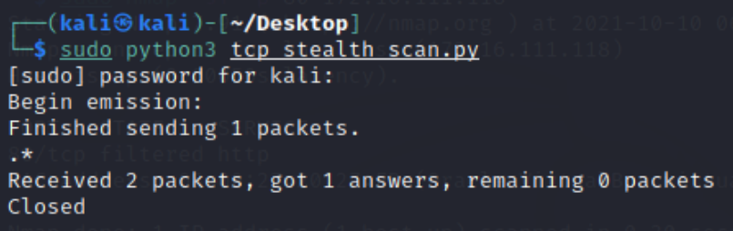

  - 靶机抓包结果

    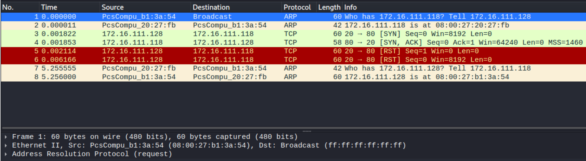

  - nmap复刻

    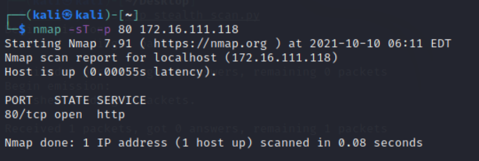

- 开启状态

  - 攻击者主机运行代码

    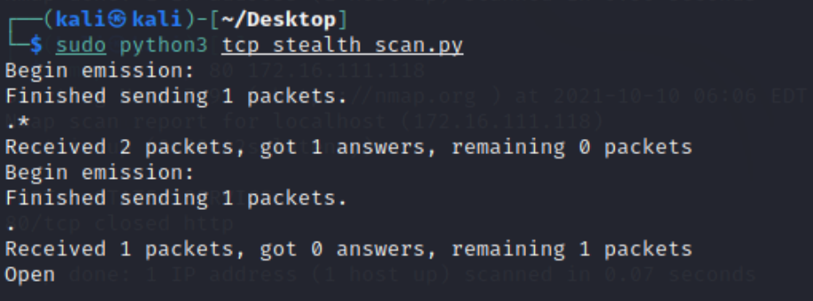

  - 靶机抓包结果

    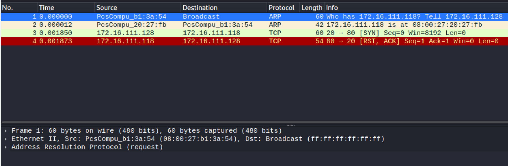

  - nmap复刻

    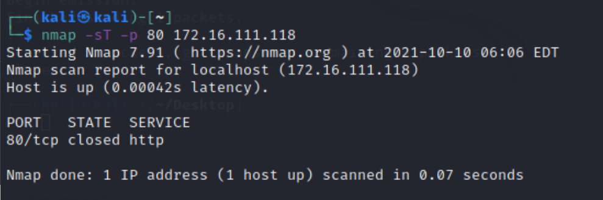

- 过滤状态

  - 攻击者主机运行代码

    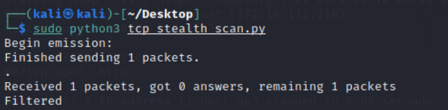

  - 靶机抓包结果

    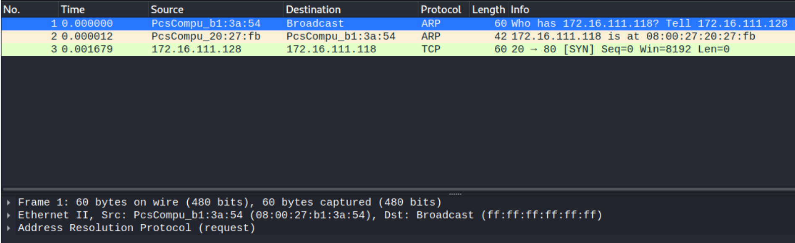

  - nmap复刻

    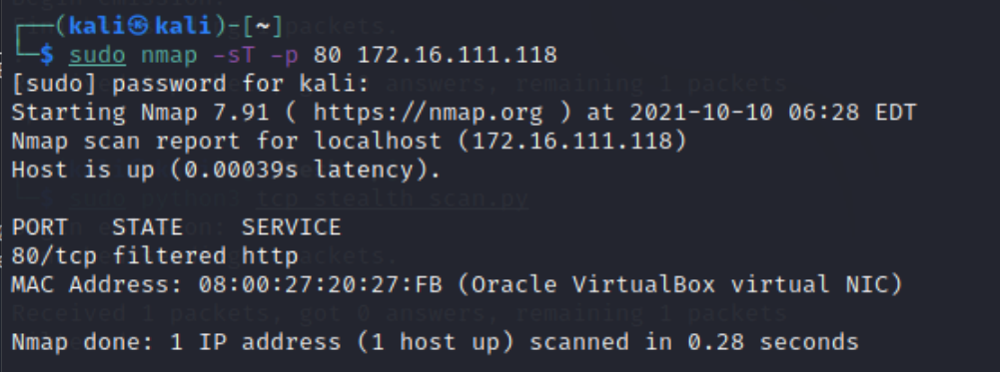

### 3. TCP Xmas scan

```
from scapy.all import *


def Xmasscan(dst_ip, dst_port, timeout=10):
    pkts = sr1(IP(dst=dst_ip)/TCP(dport=dst_port, flags="FPU"), timeout=10)
    if (pkts is None):
        print("Open|Filtered")
    elif(pkts.haslayer(TCP)):
        if(pkts.getlayer(TCP).flags == 0x14):
            print("Closed")
    elif(pkts.haslayer(ICMP)):
        if(int(pkts.getlayer(ICMP).type) == 3 and int(pkts.getlayer(ICMP).code) in [1, 2, 3, 9, 10, 13]):
            print("Filtered")


Xmasscan('172.16.111.118', 80)
```

- 关闭状态

  - 攻击者主机运行代码

    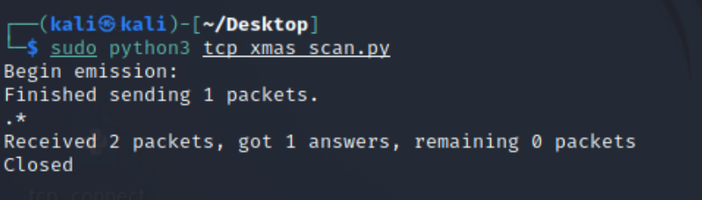

  - 靶机抓包结果

    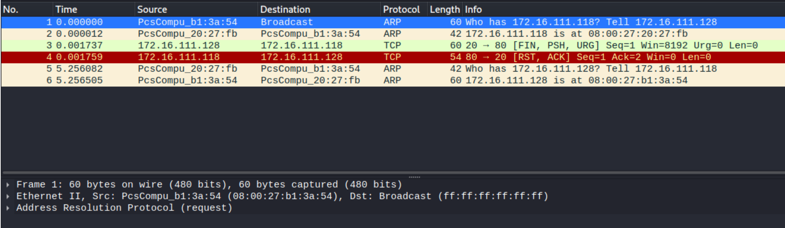

  - nmap复刻

    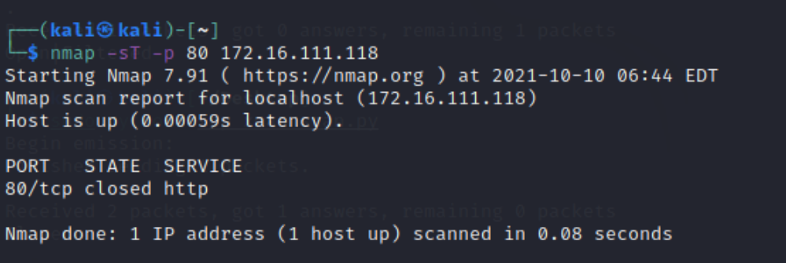

- 开启状态

  - 攻击者主机运行代码

    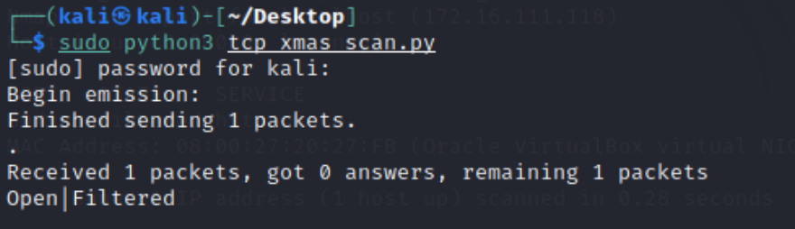

  - 靶机抓包结果

    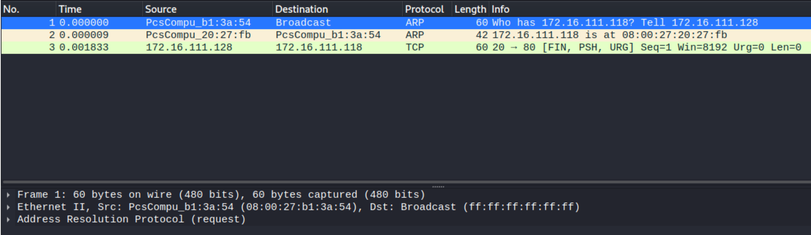

  - nmap复刻

    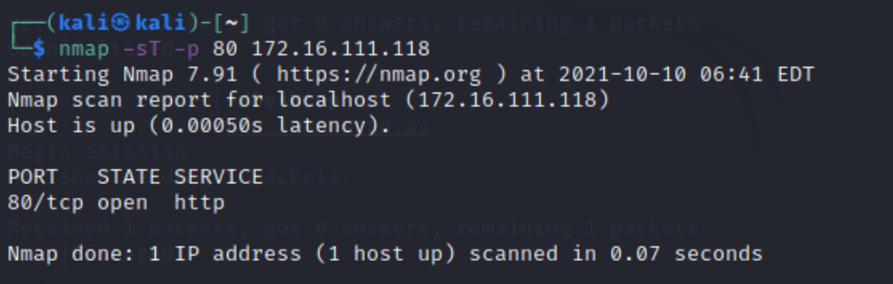

- 过滤状态

  - 攻击者主机运行代码

    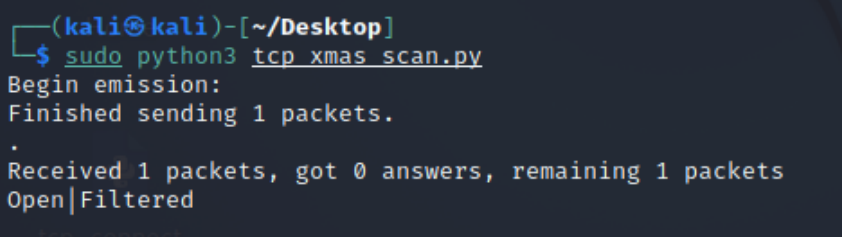

  - 靶机抓包结果

    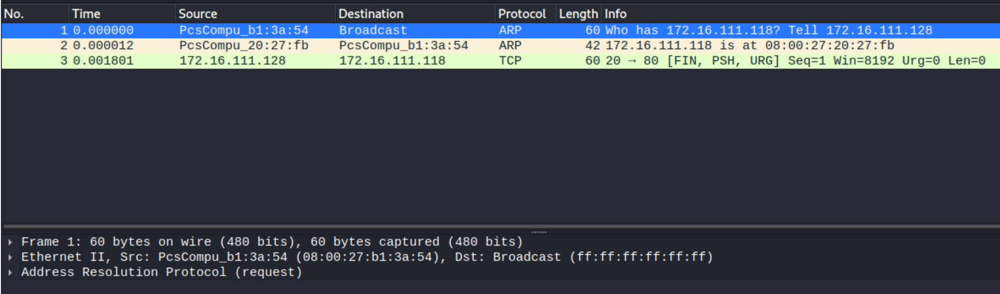

  - nmap复刻

    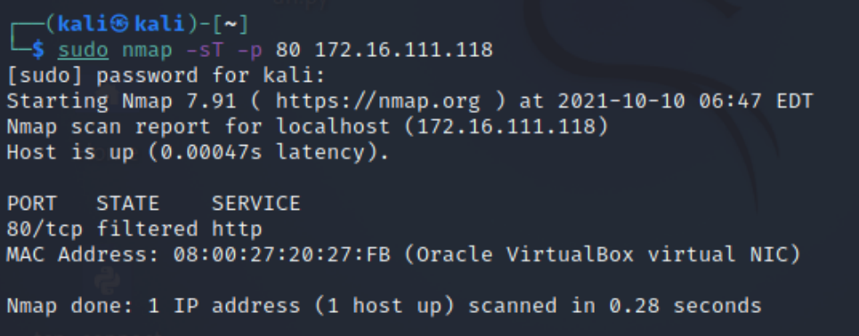

### 4. TCP fin scan 

```
from scapy.all import *


def finscan(dst_ip, dst_port, timeout=10):
    pkts = sr1(IP(dst=dst_ip)/TCP(dport=dst_port, flags="F"), timeout=10)
    if (pkts is None):
        print("Open|Filtered")
    elif(pkts.haslayer(TCP)):
        if(pkts.getlayer(TCP).flags == 0x14):
            print("Closed")
    elif(pkts.haslayer(ICMP)):
        if(int(pkts.getlayer(ICMP).type) == 3 and int(pkts.getlayer(ICMP).code) in [1, 2, 3, 9, 10, 13]):
            print("Filtered")


finscan('172.16.111.118', 80)
```

- 关闭状态

  - 攻击者主机运行代码

    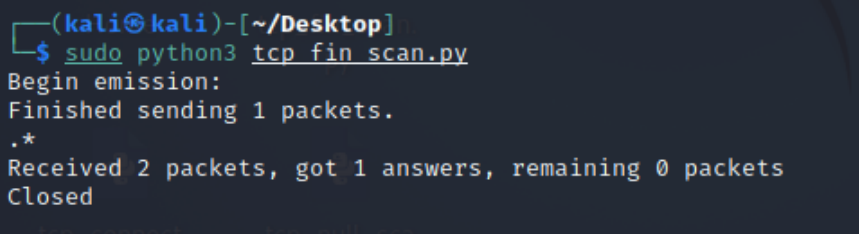

  - 靶机抓包结果

    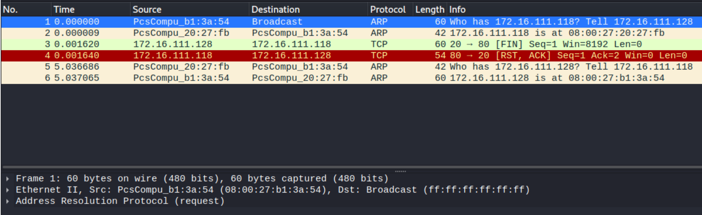

  - nmap复刻

    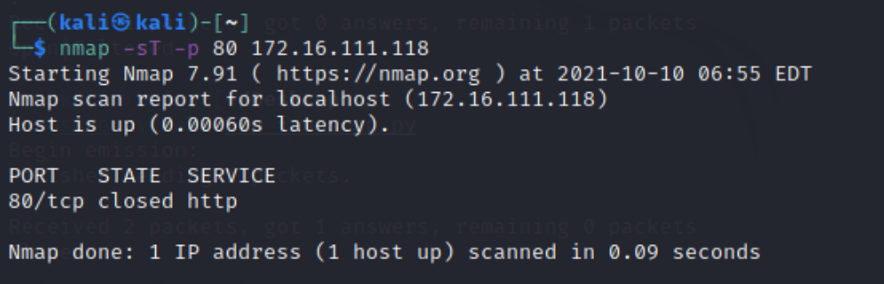

- 开启状态

  - 攻击者主机运行代码

    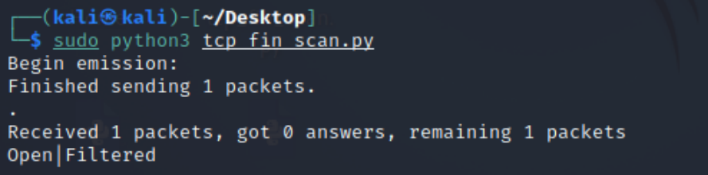

  - 靶机抓包结果

    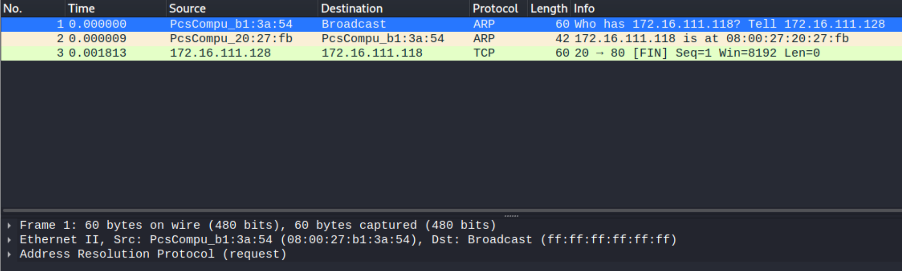

  - nmap复刻

    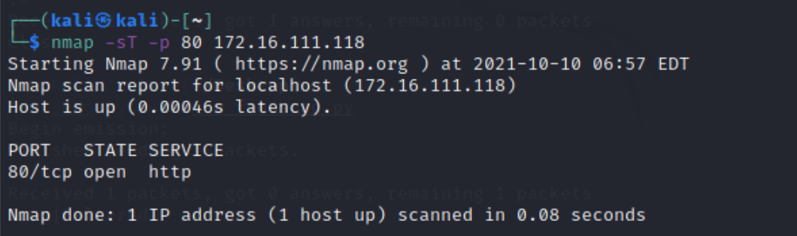

- 过滤状态

  - 攻击者主机运行代码

    

  - 靶机抓包结果

    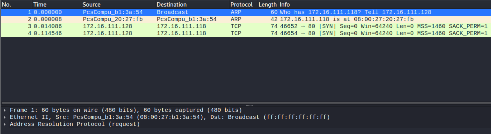

  - nmap复刻

    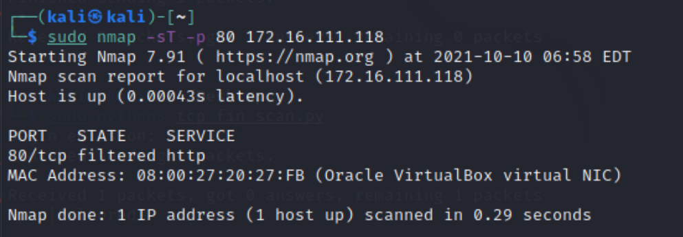

### 5. TCP null scan

```
from scapy.all import *


def nullscan(dst_ip, dst_port, timeout=10):
    pkts = sr1(IP(dst=dst_ip)/TCP(dport=dst_port, flags=""), timeout=10)
    if (pkts is None):
        print("Open|Filtered")
    elif(pkts.haslayer(TCP)):
        if(pkts.getlayer(TCP).flags == 0x14):
            print("Closed")
    elif(pkts.haslayer(ICMP)):
        if(int(pkts.getlayer(ICMP).type) == 3 and int(pkts.getlayer(ICMP).code) in [1, 2, 3, 9, 10, 13]):
            print("Filtered")


nullscan('172.16.111.118', 80)
```

- 关闭状态

  - 攻击者主机运行代码

    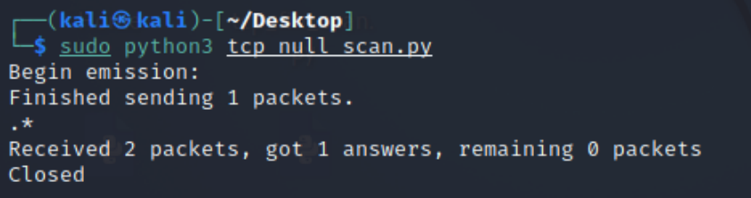

  - 靶机抓包结果

    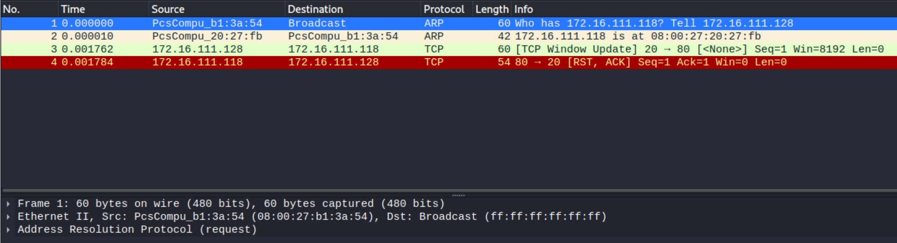

  - nmap复刻

    

- 开启状态

  - 攻击者主机运行代码

    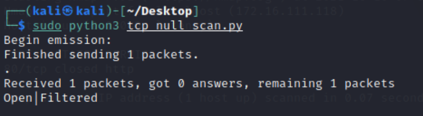

  - 靶机抓包结果

    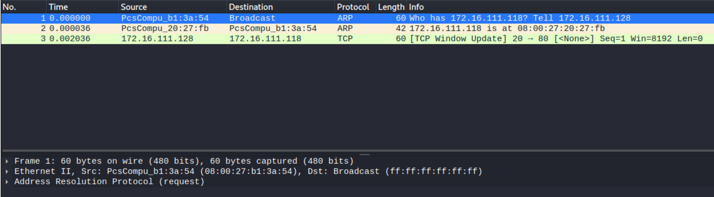

  - nmap复刻

    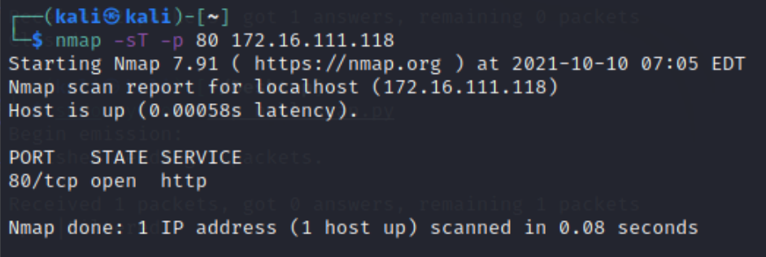

- 过滤状态

  - 攻击者主机运行代码

    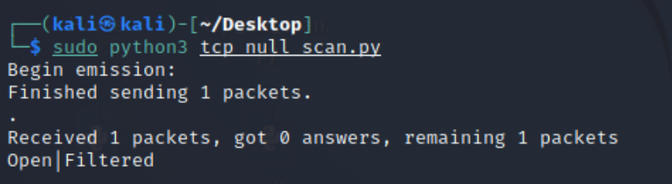

  - 靶机抓包结果

    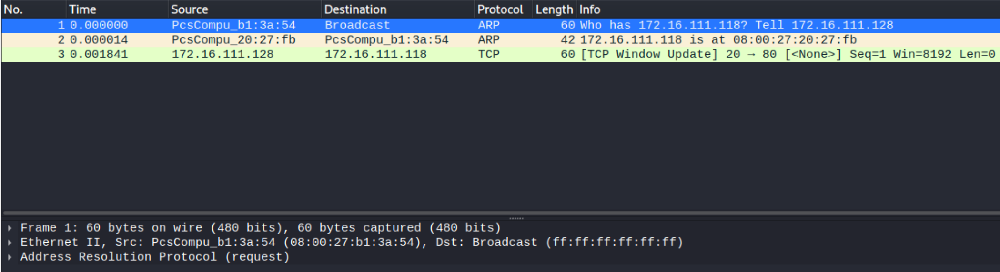

  - nmap复刻

    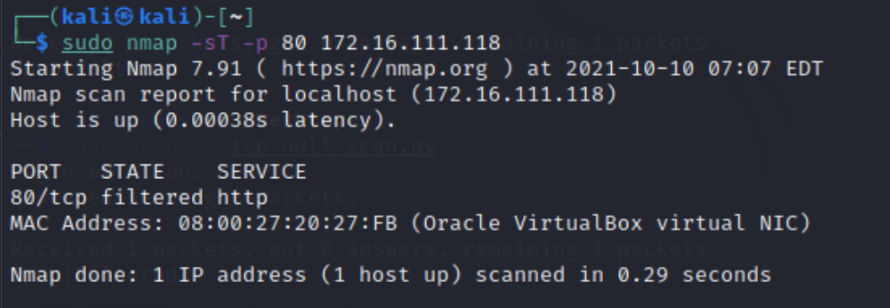

### 6. UDP scan

```
from scapy.all import *


def udpscan(dst_ip, dst_port, dst_timeout=10):
    resp = sr1(IP(dst=dst_ip)/UDP(dport=dst_port), timeout=dst_timeout)
    if (resp is None):
        print("Open|Filtered")
    elif (resp.haslayer(UDP)):
        print("Open")
    elif(resp.haslayer(ICMP)):
        if(int(resp.getlayer(ICMP).type) == 3 and int(resp.getlayer(ICMP).code) == 3):
            print("Closed")
        elif(int(resp.getlayer(ICMP).type) == 3 and int(resp.getlayer(ICMP).code) in [1, 2, 9, 10, 13]):
            print("Filtered")
        elif(resp.haslayer(IP) and resp.getlayer(IP).proto == IP_PROTOS.udp):
            print("Open")


udpscan('172.16.111.118', 53)
© 2021 GitHub, Inc.
```

- 关闭状态

  - 攻击者主机运行代码

    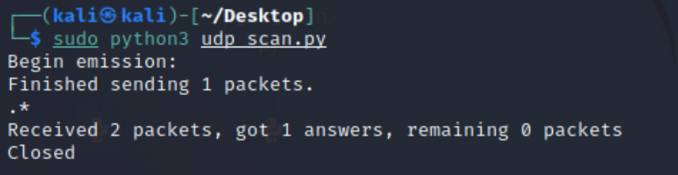

  - 靶机抓包结果

    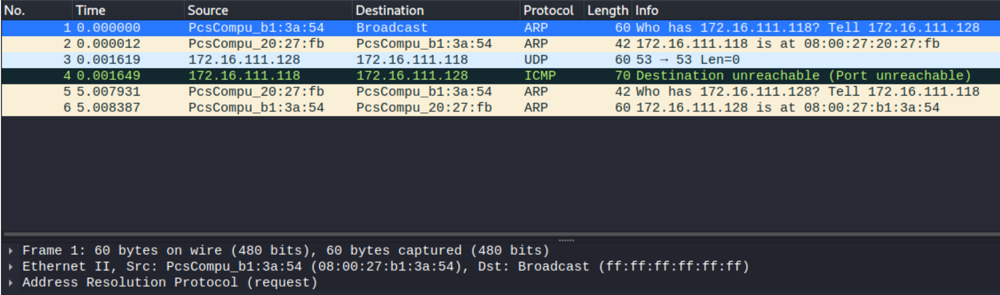

  - nmap复刻

    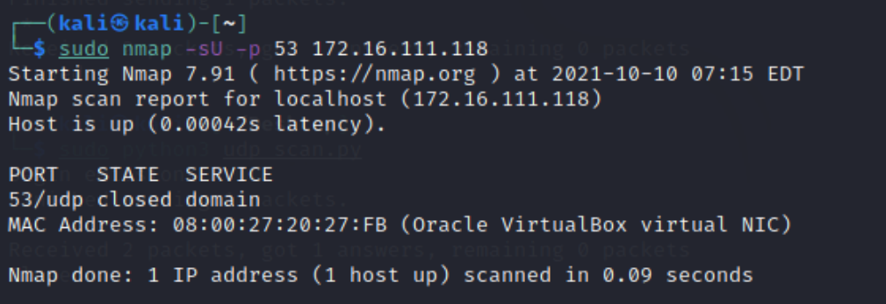

- 开启状态

  - 攻击者主机运行代码

    

  - 靶机抓包结果

    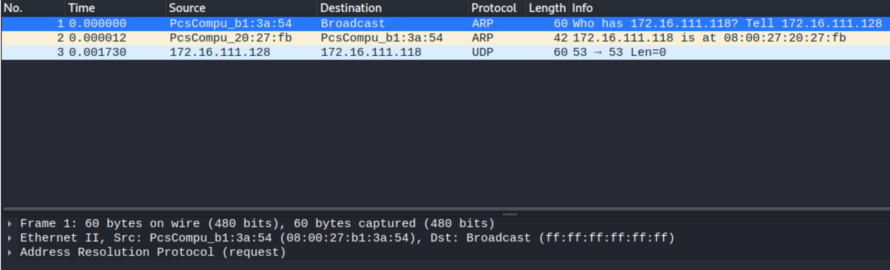

- 过滤状态

  - 靶机状态设置

  

  - 攻击者主机运行代码

    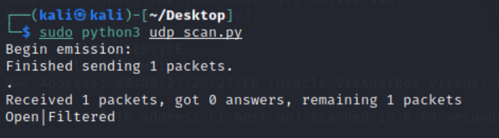

  - 靶机抓包结果

    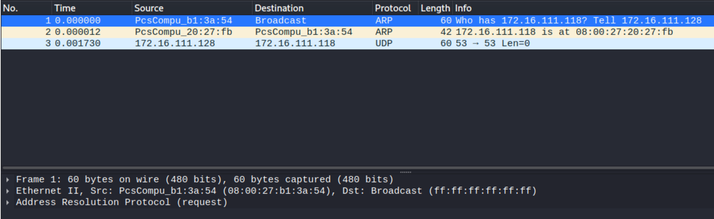

  - nmap复刻

    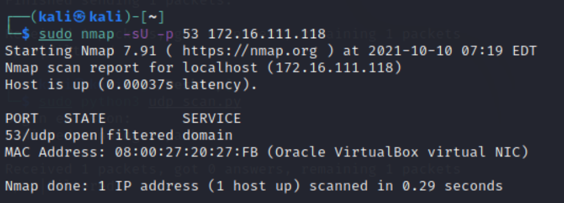

## 参考链接

1. [2020-ns-public-LyuLumos](https://github.com/CUCCS/2020-ns-public-LyuLumos/tree/ch0x05/ch0x05)
2. [Port scanning using Scapy](https://resources.infosecinstitute.com/topic/port-scanning-using-scapy/)
3.  [第五章 网络扫描](https://c4pr1c3.gitee.io/cuc-ns/chap0x05/main.html)

